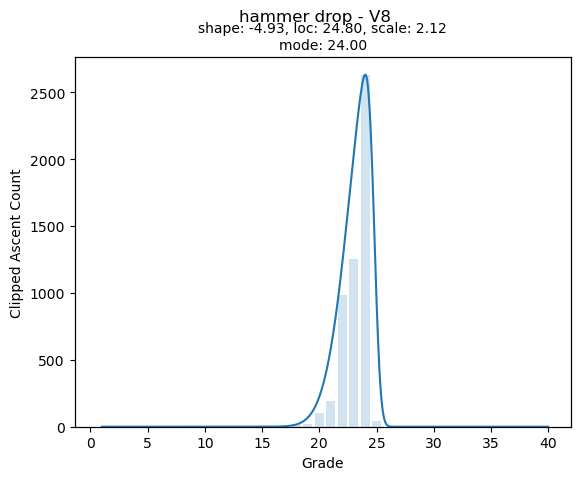
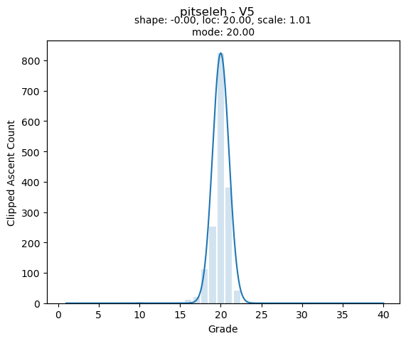

# KilterBench

## The problem

One issue with the Kilter Board ecosystem is the "Quick Log Ascent" feature that automatically log a flash which agrees with the assigned grade. If the assigned grade is too soft/hard, there is very little opportunity to correct this as the "Quick Log" ascents quickly dominate the grade histogram for the climb. This can make it really hard to consistently find climbs at a given grade without checking the grade histogram (under Info on the climb) and leads to climbs that everyone agrees are woefully sandbagged or soft (like everyones favourite "V8", Hammer Drop).

This issue is solved on the Moon Board by having a curated subset of climbs that are designated as Benchmarks. The Kilter Board has no notion of benchmarks (yet).

## An attempt at a solution

The main thing that helps us identify benchmarks is a nice, normally distributed grade histogram where a roughly equal number of people think the climb is too soft and too hard. The way this program attacks the problem is by fitting a skewed normal distribution to the grade histogram of each climb, and then filtering out any climbs that are "too skewed".

The raw histograms have some issues that make this process hard:
- There is a massive spike at the assigned grade, caused by the "Quick Log Ascent" feature mentioned above.
- Climbs with few repeats don't have enough data to fit a meaningful distribution.

These issues are resolved by truncating the assigned grade count such that the assigned grade is at most 50% of the total repeats and by filtering out climbs with less than some number (by default 500) of repeats.

While it is attractive to simply fit a skewed normal distribution to the filtered ascent data, this doesn't work that well as the best fit for a skewed ascent distribution can shift the peak (mode) of the distribution away from the assigned grade. Since we really care about how skewed the distributions are, what we really want is the fitted distribution __given that the distribution mode matches the assigned grade__. This necessitates a less efficient fitting process where we minimise a combination of the goodness of fit (using the CRPS score) and the distance of the distribution mode from the assigned grade, see `fit_grade_curve()` in [src/kilterbench/benchmarks.py](src/kilterbench/benchmarks.py)

This process creates fitted distributions like the below, which allow us to discriminate on the `shape` parameter of the fitted distribution, with `shape` close to zero indicating a low skew.




## How to use

Install the library by cloning this repository and installing using `pip install .` from the repository folder.

Fit the distributions to each climb by executing:
```
kilterbench fit -u "YOUR_KILTER_USERNAME" -p "YOUR_KILTER_PASSWORD"
```
 If you want to use a different number of minimum repeats, pass `--min_repeats 12345` as well. This will save the kilter climb database to a local sqlite database, and the fitted distributions to a json file. This can take quite a while, on the order of 20 minutes on my 32 thread machine.

To create circuits on your Kilter account (unfortunately theres no way to subscribe to other peoples circuits or I could just maintain a public list for people to use) execute

```
kilterbench circuit -u "YOUR_KILTER_USERNAME" -p "YOUR_KILTER_PASSWORD"
```

which will create circuits called "BM - {}" for all angles (0-70 in 5 degree increments). The circuit prefix, selected angles, and skew cutoff are controllable by optional parameters, see `kilterbench circuit --help`.

## Problems
- Fitting the curves is slow
- Higher grades dont get many benchmarks using the current methodology
- This should work for other Aurora boards (Tension, etc) with minimal changes